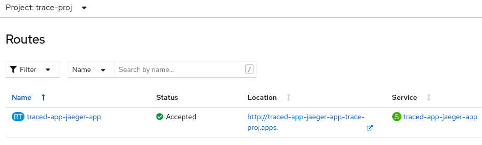
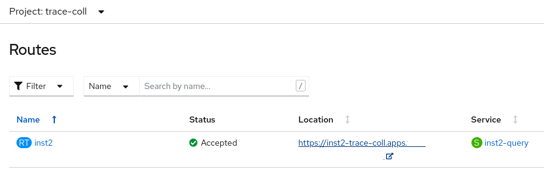
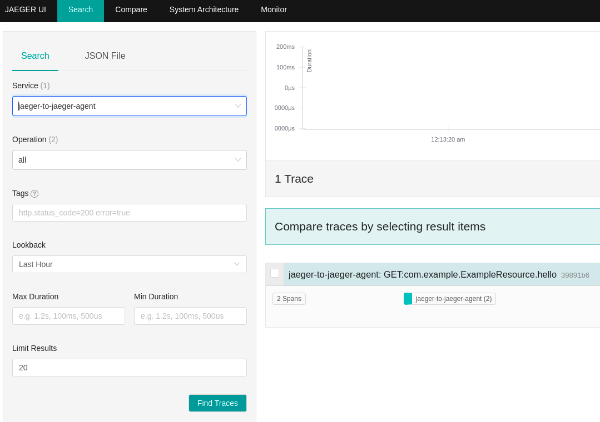

## Quarkus application with Jaeger Instrumentation and Jaeger backend
### Jaeger Agent as sidecar

**Automatic sidecar creation using Operator** - only works for applications using a "deployment":
Inside the deployment template add either generic injection request
```
metadata:
  annotations:
    "sidecar.jaegertracing.io/inject": "true"
```
or a request for a specific jaeger instance - get instance name using `oc get jaeger -A`
```
metadata:
  annotations:
    "sidecar.jaegertracing.io/inject": "instance name"
```
The Operator will add label `sidecar.jaegertracing.io/injected:` 
and the sidecar container including volume mounts for secure communication to the agent-collector.

How does the operator choose which jaeger instance to connect the jaeger-agent to when "inject" is requested?
[Select function](https://github.com/jaegertracing/jaeger-operator/blob/main/pkg/inject/sidecar.go) - Order of evaluation:
- **if** injection with specific jaeger instance name is requested on deployment, operator will try to find that in all watched namespaces,
    - **if** found, will return that instance,
    - **else** will return empty
- **if** above is defined on namespace, operator will try to find that in all watched namespaces,
    - **if** found, will return that instance,
    - **else** will go on evaluating
- **if** unspecified injection (annotation set to true) is requested on deployment or namespace
    - **if** only one available instance exists in all watched namespaces, will return that instance
    - **else if** only one instance exists in current queried namespace, will return that instance
    - **else** return empty


### With Jaeger Collector in same NS 
**Use case:**  
Multi-tenant environment where tenants are differentiated through NS - each NS has its own collector installation with each application to be traced has the agent installed as sidecar

**Example:**   
Installs two projects, each with its own agent sidecar and backend in the application namespace.
First project configures unspecific jaeger instance via inject set to true; 
Second project configures specific jaeger instance via inject set to (unique) jaeger instance name
```
cd tracing/quarkus-jaeger
./install.sh COLL_SAME_NS
```
To uninstall
```
./install.sh COLL_SAME_NS UNINSTALL
```

### With Jaeger Collector in different NS
**Use case:**   
Using one collector as a hub for several applications

**Example:**   
Installs two projects, each with its own agent sidecar but using one jaeger instance in another namespace.
First project configures unspecific jaeger instance via inject set to true;
Second project configures specific jaeger instance via inject set to (unique) jaeger instance name
```
cd tracing/quarkus-jaeger
./install.sh COLL_DIFF_NS
```
To uninstall
```
./install.sh COLL_DIFF_NS UNINSTALL
```

**Manual sidecar creation** via copying relevant sidecar configuration directly into 
Stateful sets, DeploymentConfigs, etc.

### With Jaeger Collector in different NS and Jaeger Agent as daemonset
**Use case:**   
single tenant environment - saving on resources - 
just one agent needs to be installed per node and not, like with the sidecar, 
an agent per pod

**Example:**   
Installs two projects, each without an agent but with a JAEGER_AGENT_HOST env variable to allow access 
to installed agent daemonset
```
cd tracing/quarkus-jaeger
./install.sh AGENT_DAEMONSET
```
To uninstall
```
./install.sh AGENT_DAEMONSET UNINSTALL
```

### Deployed without Jaeger Agent
**Use case:**  

**Example:**   
One application directly sending spans to the jaeger collector
```
cd tracing/quarkus-jaeger
./install.sh NO_AGENT
```
To uninstall
```
./install.sh NO_AGENT UNINSTALL
```

## Quarkus application with Otel Instrumentation and Jaeger backend
### Deployed with Otel Collector sidecar

### Deployed with Otel Collector as separate deployment 


## Installation Procedures
The below installation procedures are used inside the example installations through `install.sh`.

### Prerequisites
- Openshift Container Platform admin access
- Red Hat OpenShift distributed tracing platform Operator is installed
- oc cli, helm cli available on installing machine
- you are logged into an OCP cluster

### Application image installation into Openshift registry
Install the example applications as image streams into openshift under some separate namespace e.g. trace-img
using s2i with [ecplipse jkube openshift maven plugin](https://www.eclipse.org/jkube/docs/openshift-maven-plugin).
```shell
# switch to application module e.g. through-jaeger-agent and build application
cd "application module"
./mvnw clean install
# deploy image to openshift
# create image namespace
oc new-project trace-img
# or switch to image namespace
oc project trace-img
# run image build on openshift
./mvnw oc:build -Popenshift
```

### Application installation
Parameters that can be added to helm install from project `through-jaeger-agent`:
- `jaegerAgent.installOption`: how the jaeger agent sidecar is created (auto | manual | daemon, default: auto)
e.g. `--set jaegerAgent.installOption=auto`
- `jaegerAgent.jaegerInstance`: the jaeger instance name - only relevant for auto installation - 
(is set on same annotation that determines if agent sidecar is injected or not, default: 'true' ): 
e.g. `--set jaegerAgent.jaegerInstance=myJaegerInstance`
- `jaegerAgent.collectorAddress`: to change the collector address - only relevant for manual installation -
(default: collector in the application namespace): 
e.g. `--set jaegerAgent.collectorAddress=dns:///jaeger-all-in-one-inmemory-collector-headless.trace-coll.svc:14250`
  
Parameters that can be added to helm install from project `no-jaeger-agent`:
- `env.jaegerEndpoint`: jaeger collector address configuration, that does listen for spans send directly from the jaeger client:
e.g. `--set env.jaegerEndpoint=http://jaeger-backend-inst1-collector.trace-coll.svc.cluster.local:14268/api/traces`

```shell
# switch to application module e.g. through-jaeger-agent
cd "application module"
# create a project where the application will be installed
oc new-project trace-proj
helm install traced-app ./src/main/helm/jaeger-app -n trace-proj <parameters>
# to allow the deployment in the trace-proj namespace to access the application images installed under trace-img
# if there is a problem to add this policy, create the application images inside the same namespace like the deployment and then no extra policy is needed
oc policy add-role-to-user system:image-puller system:serviceaccount:trace-proj:traced-app-jaeger-app --namespace=trace-img
```

### Tracing environment installation

#### Option 1: All-In-One, into same namespace like application
```shell
# switch to quarkus-jaeger module
cd <project root>/quarkus-jaeger
oc apply -f ./jaeger-res/jaeger-allinone-inst1.yaml -n trace-proj
```
#### Option 2: All-In-One, into different namespace from application
```shell
# switch to quarkus-jaeger module
cd <project root>/quarkus-jaeger
oc new-project trace-coll
oc apply -f ./jaeger-res/jaeger-allinone-inst2.yaml -n trace-coll
```
#### Option 3: All-In-One with agent as daemonset in different namespace from application
(Jaeger Operator Installation Examples)[https://github.com/jaegertracing/jaeger-operator/tree/main/examples/openshift]
```shell
# switch to quarkus-jaeger module
cd <project root>/quarkus-jaeger
oc new-project trace-agent-ds
oc apply -f ./jaeger-res/jaeger-agentdaemonset.yaml -n trace-agent-ds
oc apply -f ./jaeger-res/hostport-scc-daemonset.yaml -n trace-agent-ds
```

#### Option 4: All-In-One with application directly sending to jaeger collector
Use either Option 1 or Option 2 installation for the agent collector

### Validation
1. Create spans  
Either browse to application using route and make a request to `hello` endpoint
   
Or curl to it
```
curl http://traced-app-jaeger-app-trace-proj.apps.<cluster>/hello
```
Expected response: string "hi-" with random number e.g. "hi-1656309576512"

2. Observe traces  
Choose Jaeger UI connected instances route and choose `jaeger-to-jaeger-agent` service to see trace
   
   

### Cleanup
```shell
# to cleanup between tests (not all of the namespaces are used in every test) but leaving the application images
helm uninstall traced-app -n trace-proj
oc delete project trace-proj
oc delete project trace-coll
oc delete project trace-agent-ds
# oc delete project trace-img
```
